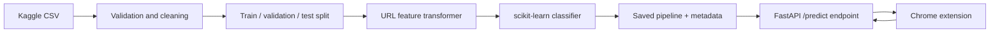

# Architecture and learning plan

## End-to-end flow

The saved object is a complete pipeline, not just a classifier. Packaging the
feature transformer with the model guarantees that training and API inference
use identical logic.

## Components

### Data layer

- Keep the downloaded CSV immutable in `data/raw/`.
- Normalize labels to `1 = phishing` and `0 = legitimate` inside our project.
- Remove exact duplicate URLs and investigate URLs with conflicting labels.
- Split by registered domain when possible, rather than randomly by row. A
  random split can place near-identical URLs from one domain in both training
  and test data, producing an unrealistically optimistic score.

### Feature layer

Start with explainable properties computable from the URL string alone:

- total URL, hostname, path, and query length;
- counts of dots, digits, hyphens, subdomains, and special characters;
- whether the hostname is an IP address;
- suspicious tokens such as `login`, `verify`, or `update`;
- HTTPS scheme (a weak signal, never proof that a site is safe);
- character entropy and encoded-character counts.

Later we can compare these hand-built features with character n-grams. We will
not fetch webpages, DNS, or WHOIS data in the first version.

### Model layer

1. Establish a dummy-classifier baseline.
2. Train logistic regression for an interpretable baseline.
3. Compare a tree-based model if it materially improves validation results.
4. Tune the probability threshold using security costs, not accuracy alone.

Because phishing detection is a safety filter, false negatives and false
positives have different costs. We will report precision, recall, F1,
PR-AUC, ROC-AUC, a confusion matrix, and threshold-specific behavior.

### API layer

FastAPI will expose:

- `GET /health` for readiness;
- `POST /predict` with `{ "url": "..." }`;
- a response containing the normalized label, phishing probability, model
  version, and a small set of human-readable reasons.

The API validates inputs and does not retrieve the submitted URL.

### Extension layer

A minimal Chrome Manifest V3 popup reads the active tab URL, calls the API,
and displays a low/medium/high risk state. During local development the API is
`http://127.0.0.1:8000`; a deployed service can be configured later.

The score is advisory. The UI must not claim a URL is guaranteed safe.

## Implemented pipeline

1. Raw-data inspection and tested cleaning.
2. Registered-domain-aware train, validation, and test splitting.
3. A dummy baseline and URL-feature logistic-regression pipeline.
4. Validation-only threshold selection and held-out test evaluation.
5. Full-pipeline joblib packaging with JSON metadata.
6. A validated FastAPI prediction endpoint.
7. A local Chrome Manifest V3 popup client.

Future production hardening would add authentication, rate limiting, telemetry,
drift monitoring, periodic label refreshes, reputation signals, and deployment
configuration.

## Boundaries of version 1

- The detector analyzes URL text; it does not inspect page content.
- It is an additional warning signal, not a replacement for browser or endpoint
  protection.
- Dataset labels may be noisy and age over time. Test results describe the
  held-out dataset, not guaranteed performance on future attacks.
